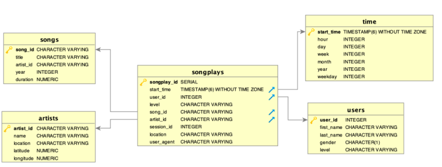

# Project Background

A startup called Sparkify wants to analyze the data they've been collecting on songs and user activity on their new music streaming app. The analytics team is particularly interested in understanding what songs users are listening to. Currently, they don't have an easy way to query their data, which resides in a directory of JSON logs on user activity on the app, as well as a directory with JSON metadata on the songs in their app.

They'd like a data engineer to create a Postgres database with tables designed to optimize queries on song play analysis, and bring you on the project. Your role is to create a database schema and ETL pipeline for this analysis. You'll be able to test your database and ETL pipeline by running queries given to you by the analytics team from Sparkify and compare your results with their expected results.

# Purpose of Database

The database is designed to optimise queries on song play analysis as Sparkify does not currently have an easy way to query the data. The analytical goals of Sparkify are to use the collected data to understand what songs its users are listening to.

# Database Schema

## Fact Table
- songplays: records in log data associated with song plays i.e. records with page 'NextSong'
    - Fields: *ksongplay_id, start_time, user_id, level, song_id, artist_id, session_id, location, user_agent*

## Dimension Tables
- users: users in the app
    - Fields: *user_id, first_name, last_name, gender, level*
- songs: songs in music database
    - Fields: *song_id, title, artist_id, year, duration*

- artists: artists in music database
    - Fields: *artist_id, name, location, latitude, longitude*

- time: timestamps of records in 'songplays' broken down into specific units
    - Fields: *start_time, hour, day, week, month, year, weekday*
 
The database makes use of a star schema as it simplifies queries and has fast aggregations, which is what the users need to easily query the data and get counts of the relevant items as needed to understand what songs users are listening to.

# Datasets and files in repository
`data` - This folder contains the datasets to be used.
`create_tables.py` - Contains code to create tables as part of the database. Creates the 'sparkifydb' Postgres database as well as the fact and dimension tables as mentioned above.
`etl.ipynb` - Jupyter Notebook for detailed walkthrough of each step. Steps are similar to `etl.py`
`etl.py` - Actual file used for ETL of dataset. Reads JSON logs and JSON metadata and performs ETL to load the data into tables in the database.
`test.ipynb` - Jupyter Notebook for connection to 'sparkifydb' and to visually validate data loaded from the previous Python files into the database.

## Datasets
`songs` - subset of real data from the [Million Song Dataset](http://millionsongdataset.com/)
`log` - generated by [eventsim](https://github.com/Interana/eventsim)

# How to run
Please ensure that you have Python 3 and PostgreSQL installed in your system.
The following Python libraries need to be installed as well:
`os
psycopg2
pandas
sql_queries`

Run the following commands to create the tables and to load the data into the tables in the database.
`python create_tables.py
python etl.py`

NOTE: Ensure that `create_tables.py` is run before `etl.py`. Do remember to close the connection to the created database by restarting the kernels or by using `conn.close()` to programmatically close the connection.